# The Secret Internet: From Military Weapon to World Wide Web
————————————————————————————————————————————————————————————  
[Timeline - The Secret Internet: From Military Weapon to World Wide Web](https://larryzpl123.github.io/The-Secret-Internet-From-Military-Weapon-to-World-Wide-Web/) 
————————————————————————————————————————————————————————————  
————————————————————————————————————————————————————————————  
[Padlet Version (Embed in Github Site Version) #not maintained anymore](https://larryzpl123.github.io/The-Secret-Internet-From-Military-Weapon-to-World-Wide-Web/index-embedded.html) 
————————————————————————————————————————————————————————————  
# The Secret Internet: From Military Weapon to World Wide Web

# Timeline

**Author:** Larry Zhong

---

## 1940.9.11 – First Remote Computing Demo at Bell Labs

Bell Labs mathematician **George Stibitz** demonstrates the Complex Number Computer by sending instructions over a teletype line from a Dartmouth math conference in New Hampshire to the machine in New York City—250 miles away.[^1]

This is the world's first long‑distance computing session: fifteen years before commercial computers exist and twenty‑nine years before ARPANET. Norbert Wiener, Claude Shannon, and John von Neumann are all in the audience. None of them grasps that they have just witnessed the *first packet of a network that will eventually circle the planet.*

---

## 1943.2.5 – Colossus Codebreaker Becomes Operational

British engineer **Tommy Flowers** builds **Colossus**, the world's first programmable electronic digital computer, in secret at Bletchley Park to help break the German Lorenz cipher used for Hitler’s strategic communications.[^2]

Colossus exists eleven years before the public knew electronic computers were possible, and stays classified until the 1970s. It is the first proof that computing can be a *weapon*. Britain’s reluctance to disclose its existence quietly hands the postwar computing lead to the United States.

---

## 1945.6.30 – Von Neumann’s EDVAC Report Defines Modern Computing

John von Neumann, working under U.S. Army contract, circulates the *First Draft of a Report on the EDVAC*. The 101‑page document describes a computer that stores its program and data in the same memory—what the world will spend the next eighty years calling **the von Neumann architecture**.[^3]

Every consumer computer ever sold, from the Apple II to the iPhone to the Mac running this webpage, is built on this design. The fact that the Army leaks the report freely—refusing to patent it—accidentally hands the design to the entire world.

---

## 1945.7 – Vannevar Bush Publishes ‘As We May Think’

Vannevar Bush—FDR’s wartime science adviser and the architect of America’s military R&D establishment—publishes an essay in **The Atlantic Monthly** imagining a desktop machine called the *Memex* that lets a single user link any document to any other document by association.[^4]

The Memex never existed, but its logic is the conceptual ancestor of hypertext, the World Wide Web, and the modern search engine. Crucially, Bush is writing as the architect of the *military‑academic complex*: his vision is born inside the same federal R&D apparatus that will, twenty years later, fund ARPANET.

---

## 1945.8.6–1945.8.9 – Atomic Bombs Dropped on Hiroshima and Nagasaki

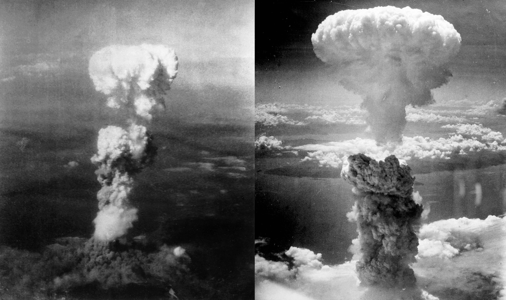

On August 6 and 9, 1945, the United States detonates **two atomic bombs** over Japanese cities, ending the Second World War and unveiling a weapon capable of erasing a city in minutes.[^5]

For the next half‑century every American defense decision—including the decision to fund a *“survivable” computer network*—will be made under the assumption that a single Soviet first strike could destroy the country’s command‑and‑control system in under thirty minutes. The internet is, in a very direct sense, the bomb’s grandchild.

---

## 1946.2.14 – ENIAC, the First Public Electronic Computer, Unveiled

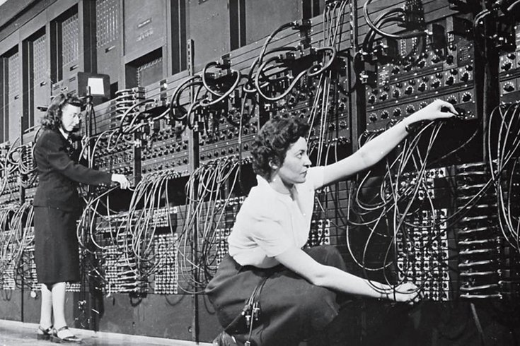

The U.S. Army unveils the **Electronic Numerical Integrator and Computer (ENIAC)** at the University of Pennsylvania. Built secretly during the war to calculate artillery firing tables, it weighs thirty tons, fills a room, and contains 17,468 vacuum tubes.[^6]

ENIAC is the first time the American public sees that the computer revolution is real, and it is presented as an unambiguous *weapon* of the United States military. The six women who actually programmed it—Kay McNulty, Betty Jennings, and four others—are not invited to the press unveiling.

---

## 1947.12.23 – The Transistor Is Invented at Bell Labs

John Bardeen, Walter Brattain, and William Shockley demonstrate the first working point‑contact transistor at **Bell Telephone Laboratories** in Murray Hill, New Jersey.[^7]

The transistor replaces the bulky, fragile vacuum tube and makes it physically possible to build computers small, cheap, and reliable enough to be installed in thousands of locations across a continent. *Without the transistor, there is no internet*—every node would still be a refrigerator‑sized vacuum‑tube machine that ran hot enough to ignite paper.

---

## 1948.7 – Shannon Publishes ‘A Mathematical Theory of Communication’

Bell Labs mathematician **Claude Shannon** publishes a 79‑page article in the *Bell System Technical Journal* that creates the field of information theory from scratch.[^8]

Shannon’s central insight: any message—voice, image, language, video—can be measured in **bits** and transmitted reliably over a noisy channel as long as you stay under a calculable speed limit. Every digital communication system that has ever existed obeys Shannon’s law. The compression algorithm that delivered this webpage to your browser is a Shannon descendant.

---

## 1949.8.29 – USSR Detonates First Atomic Bomb

The Soviet Union successfully tests **RDS‑1**—its first atomic weapon—at Semipalatinsk, four years earlier than American intelligence had predicted.[^9]

The American nuclear monopoly is over. Within months, President Truman authorizes development of the hydrogen bomb and a massive expansion of military R&D spending. The fear that the Soviets might match or exceed U.S. computing and missile capabilities will drive every networking decision for the next forty years.

---

## 1951.6.14 – First Commercial Computer Delivered to U.S. Census Bureau

The Eckert‑Mauchly Computer Corporation delivers **UNIVAC I** to the U.S. Census Bureau. It is the first computer in history to be sold to a non‑military customer—though the customer is still the federal government.[^10]

The next year, UNIVAC famously predicts on live CBS television that Eisenhower will defeat Stevenson in a landslide; the network executives, distrusting the machine, suppress the forecast until election results begin to confirm it. This is *the first time most Americans see a computer*.

---

## 1952.11.1 – Ivy Mike: First Hydrogen Bomb Tested

The United States detonates **Ivy Mike**, the first true thermonuclear weapon, on Elugelab Island in the Pacific. The 10.4‑megaton blast vaporizes the entire island and leaves a crater 6,000 feet across.[^11]

Hydrogen bombs are roughly a thousand times more powerful than the Hiroshima device. The escalating destructiveness of nuclear weapons makes “survivable command and control”—networks that work *after* a strike—an existential national‑security priority. Three years later, that priority becomes the **SAGE** air‑defense network.

---

## 1955 – SAGE Air‑Defense Network Begins Operation

The U.S. Air Force begins deploying the **Semi‑Automatic Ground Environment (SAGE)** system—twenty‑three concrete bunkers across North America, each housing a 250‑ton IBM AN/FSQ‑7 computer, all wired together by long‑distance telephone lines to track Soviet bombers in real time.[^12]

SAGE is the first wide‑area computer network in human history. It introduces the modem, real‑time graphical displays, and the light‑pen—all of which will reappear as civilian technology a decade later. SAGE costs more than the Manhattan Project. It never sees combat.

---

## 1956.9.25 – First Transatlantic Telephone Cable Goes Live

AT&T and the British Post Office activate **TAT‑1**, the first transatlantic submarine telephone cable, running between Newfoundland and Scotland. It carries thirty‑six simultaneous voice channels.[^13]

TAT‑1 ends sixty years of unreliable transatlantic shortwave radio and creates the physical pipe over which transatlantic data—including the first overseas ARPANET node in 1973—will eventually flow. Today the same cable corridor carries roughly 99 percent of all data between North America and Europe.

---

## 1957.10.4 – USSR Launches Sputnik 1

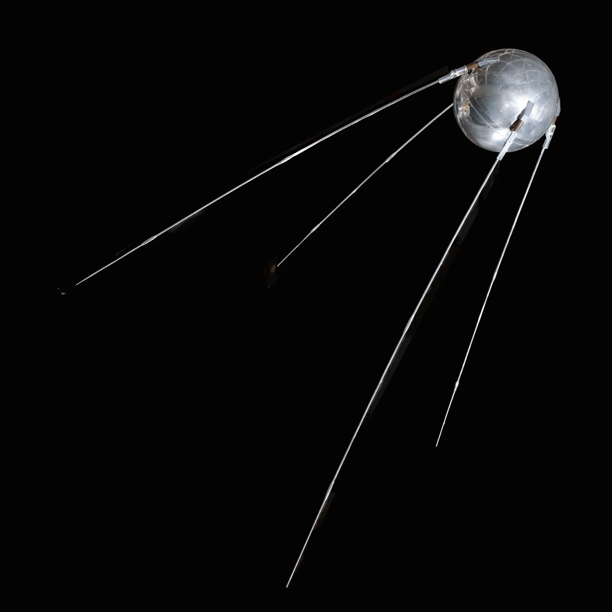

The Soviet Union places the first artificial satellite into low Earth orbit. The 184‑pound aluminum sphere broadcasts a simple radio “beep” that any American with a shortwave receiver can hear passing overhead every 96 minutes.[^14]

The political shock is immediate. If the Soviets can put a satellite over Washington, they can put a *thermonuclear warhead* there too. President Eisenhower’s response—within four months—will permanently restructure how the United States funds science and engineering and lay the institutional groundwork for everything that becomes the internet.

---

## 1958.2.7 – ARPA Created

President Eisenhower signs DoD Directive 5105.15, establishing the **Advanced Research Projects Agency (ARPA)** inside the Pentagon.[^15]

ARPA’s mandate is deliberately broad—*fund whatever research keeps the United States ahead of the Soviet Union*—and its budget is large and largely unaccountable. Within a decade, ARPA money will fund packet switching, time‑sharing, computer graphics, and the artificial‑intelligence labs at MIT, Stanford, and Carnegie Mellon. Almost every major civilian computing breakthrough of the 1960s and 70s passes through ARPA’s checkbook first.

---

## 1958.9.12 – Jack Kilby Demonstrates the First Integrated Circuit

At Texas Instruments in Dallas, engineer **Jack Kilby** demonstrates a working integrated circuit—five components etched onto a single half‑inch sliver of germanium.[^16]

Six months later Robert Noyce at Fairchild Semiconductor independently invents a silicon version. Together they make Moore’s Law possible: the doubling of transistor density every eighteen months that will, by 2026, put more computing power in a high‑school student’s pocket than the entire Apollo program had on the Moon.

---

## 1961.11 – MIT Demonstrates the First Time‑Sharing Computer

MIT computer scientist **Fernando Corbató** demonstrates the **Compatible Time‑Sharing System (CTSS)**—the first computer that lets multiple users run programs at the same time from separate terminals.[^17]

Time‑sharing is the conceptual precondition for networking: if a single computer can serve many users, then it makes sense to ask whether many computers, in different cities, could serve *each other*. Licklider sees CTSS in action and immediately starts writing the memos that will become ARPANET.

---

## 1962.4 – Licklider’s ‘Galactic Network’ Memos

J. C. R. Licklider, newly appointed to run ARPA’s Information Processing Techniques Office, circulates a series of internal memos addressed—only half‑jokingly—to “Members and Affiliates of the **Intergalactic Computer Network**.”[^18]

The memos describe a future in which *every computer in the country is connected to every other*, and any user can access any program or dataset remotely. At the time, computers are room‑sized objects that cannot even talk to the machine next door. On the other side of the Iron Curtain, Soviet cyberneticist Viktor Glushkov simultaneously proposes **OGAS**, a nationwide computer network for managing the planned economy. OGAS is killed by Politburo infighting and never built—a striking what‑if for an alternate‑history internet.

---

## 1962.10.16–1962.10.28 – Cuban Missile Crisis

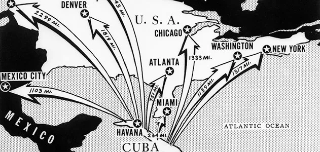

For thirteen days in October 1962, the United States and Soviet Union come closer to nuclear war than at any other point in the Cold War, after American U‑2 reconnaissance flights confirm that Soviet medium‑range ballistic missiles have been installed in Cuba.[^19]

The crisis is resolved partly by direct teletype communication between Kennedy and Khrushchev. Within a year, the **Moscow‑Washington hotline** is installed—one of the earliest dedicated international data links, designed precisely so that future crises cannot escalate through misunderstood radio messages or slow diplomatic cables.

---

## 1964 – Paul Baran Publishes ‘On Distributed Communications’

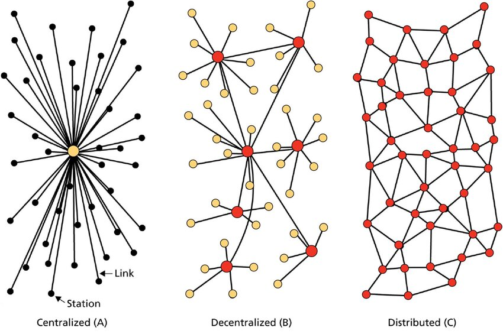

At the **RAND Corporation**—an Air Force‑funded think tank in Santa Monica—engineer Paul Baran publishes a twelve‑volume report describing how to build a communications network capable of surviving a nuclear strike.[^20]

Baran’s central insight: a network shaped like a *fishnet*, with many small nodes each connected to several others, has no central headquarters to bomb. Even if half the nodes are destroyed, messages still get through by automatically rerouting around the damage. This is **packet switching**—the fundamental architecture the entire internet still uses today.

---

## 1965.10 – First Wide‑Area Computer‑to‑Computer Connection

ARPA contractor **Larry Roberts** and SDC engineer Tom Marill connect MIT’s TX‑2 computer in Massachusetts to the Q‑32 computer in Santa Monica using a low‑speed dial‑up phone line—the first wide‑area computer‑to‑computer connection in history.[^21]

The link works, barely. Roberts concludes that conventional telephone circuits are *hopeless* for serious networking and that something fundamentally new—packet switching—is required. He becomes ARPA’s program manager for ARPANET two years later.

---

## 1966.10 – Donald Davies Coins the Phrase ‘Packet Switching’

At Britain’s **National Physical Laboratory** in Teddington, computer scientist Donald Davies independently develops the same network architecture as Paul Baran and gives it the name the world will use forever: **packet switching**.[^22]

Davies’s NPL Mark I network, built the next year, is the first operational packet‑switched network anywhere. It also proves that the idea is not *inherently* a Cold War weapon: Davies designs it explicitly for civilian commercial use. ARPA’s Larry Roberts adopts the British vocabulary when he begins planning ARPANET.

---

## 1968.12.9 – Engelbart’s ‘Mother of All Demos’

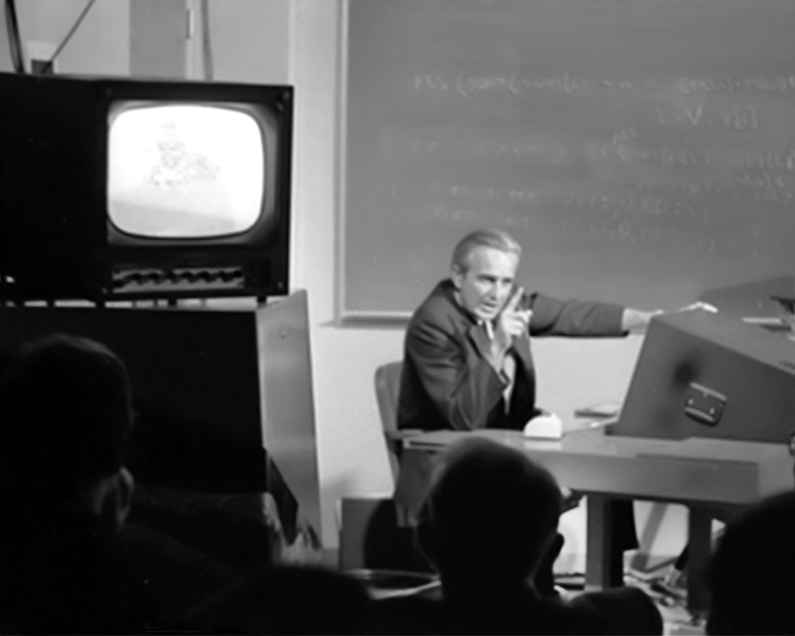

At the Fall Joint Computer Conference in San Francisco, Stanford Research Institute engineer **Douglas Engelbart** demonstrates, in a single 90‑minute session, the **mouse, hypertext, real‑time text editing, video conferencing, screen sharing, and a windowed graphical interface**.[^23]

Almost every feature of the personal computer that has not yet been invented in 1968, Engelbart unveils on stage. SRI is two years away from being one of the first four ARPANET nodes; the *demo itself* is performed over a leased microwave link from SRI in Menlo Park to the conference auditorium downtown.

---

## 1969.7.20 – Apollo 11 Lands on the Moon

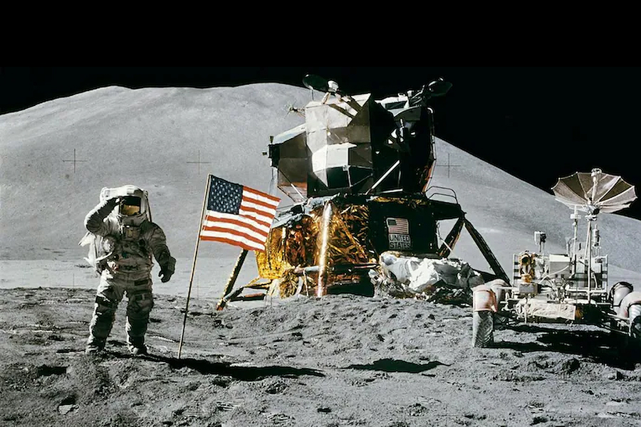

Twelve years after Sputnik, **Apollo 11** lands Neil Armstrong and Buzz Aldrin on the lunar surface, fulfilling Kennedy’s 1961 pledge and decisively winning the Space Race.[^24]

The mission’s lunar guidance computer—designed at MIT and built around the new integrated circuit—is the smallest computer ever built up to that date. The same engineering culture that puts Americans on the Moon is, three months later, going to put **the first packet on ARPANET**. Both projects are funded by the same Cold War political consensus.

---

## 1969.10.29 – ARPANET Goes Online

At **10:30 p.m. Pacific time**, UCLA graduate student Charley Kline types the word “LOGIN” to send the first message over ARPANET to a second computer at Stanford Research Institute. After two letters—*L, O*—the system crashes.[^25]

The first message ever sent on the ancestor of the internet is therefore the accidental word **“LO”**. The crash is fixed within an hour and the full message goes through the same night. Within two months, four nodes are online: UCLA, SRI, UC Santa Barbara, and the University of Utah—all funded by the Pentagon.

---

## 1971.10 – Ray Tomlinson Invents Email

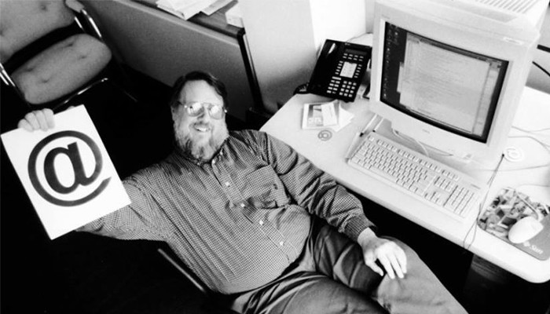

BBN engineer **Ray Tomlinson** writes a small program called SNDMSG that lets users on different ARPANET hosts send each other messages, separating user from host with the **@ symbol** because it was the only character on his teletype not already used in usernames.[^26]

Tomlinson does not bother to patent the program or even tell most of his colleagues. Within two years, email becomes 75% of all ARPANET traffic—the first sign that this military network is going to be used for something its funders never imagined.

---

## 1972.10.24–1972.10.26 – ARPANET Demonstrated Publicly at the ICCC

The **International Conference on Computer Communications** opens at the Washington Hilton with a working ARPANET terminal in the lobby. Conference attendees from around the world can sit down and use a network that, until that moment, only a few hundred Pentagon‑funded researchers had ever touched.[^27]

The demo converts skeptics overnight. By 1973 ARPANET has crossed the Atlantic to nodes in Norway and London; by 1975 there are research networks in France, Japan, and Germany. The Cold War weapon is leaking out into the civilian world.

---

## 1973.5.22 – Ethernet Is Invented at Xerox PARC

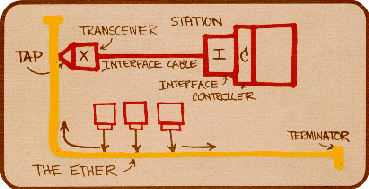

At the Xerox Palo Alto Research Center, engineer **Robert Metcalfe** writes the memo that defines **Ethernet**, the local‑area‑network protocol that will eventually wire together every office, classroom, and dorm room in the developed world.[^28]

Ethernet is the first networking technology specifically designed for civilian, non‑military use. PARC also builds the first laser printer and the first workstation with a graphical user interface in the same year—meaning that, by 1973, every component of the modern office computer exists, even though Xerox executives in New York will fail to realize this for the next ten years.

---

## 1974.5 – Cerf and Kahn Publish the TCP Paper

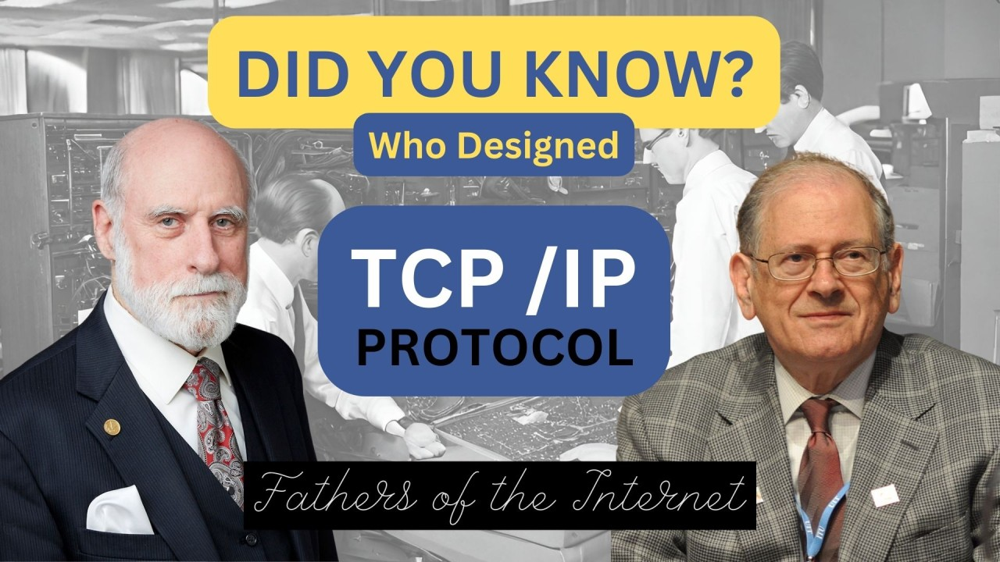

Stanford’s Vint Cerf and ARPA’s Bob Kahn publish a 13‑page paper in *IEEE Transactions on Communications* describing how *completely different networks*—radio, satellite, and ground‑based—could be tied together into a single seamless network using a common protocol they call **TCP**.[^29]

This is the conceptual birth of the *inter‑net*—the network of networks. Within ten years, TCP/IP will be the lingua franca of every computer on Earth and will allow ARPANET, NSFNET, university networks, and corporate networks to merge into a single global system.

---

## 1977.11.22 – First Three‑Network Internet Transmission

ARPA engineers transmit a single packet from a van driving down U.S. Route 101 in California, across the Atlantic via satellite, through three different networks (PRNET, SATNET, ARPANET), and back to ARPA headquarters in Virginia.[^30]

The packet is **proof that TCP/IP works**: completely different physical networks, with different speeds and different physical media, can be made to behave like a single network as long as they speak the same protocol. This is the moment “the Internet”—capital I, singular—quietly comes into existence.

---

## 1979.5.27 – USENET — The First ‘Social’ Internet

Two graduate students at Duke and the University of North Carolina, **Tom Truscott** and Jim Ellis, create **USENET**—a system for posting and reading discussion‑board messages between Unix computers connected by ordinary phone lines.[^31]

USENET is not on ARPANET. It runs on the *civilian* telephone network. By 1985 it has more users than ARPANET itself, and it shows for the first time that ordinary people, not Pentagon engineers, are willing to build their own networks if the tools become cheap enough.

---

## 1981.8.12 – IBM Releases the Personal Computer

IBM unveils the **5150 Personal Computer**—an open‑architecture machine running an operating system licensed from a small Seattle company called **Microsoft**.[^32]

The PC’s open architecture means anyone can build compatible machines and write compatible software, which immediately spawns an industry. Within four years there are tens of millions of PCs in American homes and offices, and they are *hungry* for something to talk to. The civilian demand for networking that ARPANET cannot satisfy is being created.

---

## 1983.1.1 – TCP/IP ‘Flag Day’

On **January 1, 1983**—known to network historians as “Flag Day”—every host on ARPANET is required to switch from the older NCP protocol to the new **TCP/IP** suite designed by Vint Cerf and Bob Kahn nine years earlier.[^33]

It is the largest coordinated software cutover in history up to that point and it works almost flawlessly. On the same day, ARPANET is split in two: classified military traffic moves to a separate network called **MILNET**, and the civilian‑research half is left free to evolve into what the world will eventually call *the internet*. The Pentagon has, in effect, just released its baby into the wild.

---

## 1984.11.1 – Domain Name System Introduced

USC researcher **Paul Mockapetris** publishes RFCs 882 and 883, defining the **Domain Name System**—the distributed directory that translates human‑readable names like `info.cern.ch` into the numerical IP addresses that computers actually use.[^34]

Before DNS, every host on ARPANET had to maintain a hand‑edited “HOSTS.TXT” file listing every other host. By 1983 this file is hundreds of pages long and updated weekly. DNS is what makes a network of millions of hosts conceivable. The hierarchy invented in 1984—`.com`, `.edu`, `.gov`, country codes—is still the structure of the internet today.

---

## 1985.3.23 – Reagan Announces ‘Star Wars’ Missile Defense

President Reagan announces the **Strategic Defense Initiative (SDI)**—a proposed system of space‑ and ground‑based weapons that would shoot down incoming Soviet missiles, in essence rendering nuclear war “winnable.”[^35]

SDI never works as advertised, but it pours billions of federal R&D dollars into supercomputing, satellite networking, and what we would now call **AI**—artificial‑intelligence systems for real‑time threat assessment. Many of the engineers who later build the commercial internet got their first jobs working on SDI subcontracts at Lockheed, TRW, and Boeing.

---

## 1986.7 – NSFNET — The Internet Backbone Goes Civilian

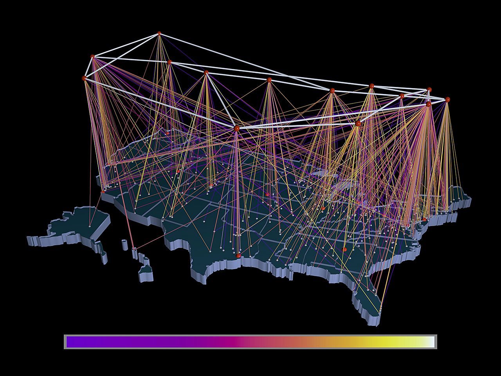

The **National Science Foundation Network** comes online, linking the country’s five new federally funded supercomputing centers at a then‑blistering 56 kilobits per second.[^36]

NSFNET is the first internet backbone the Pentagon does *not* own. Its acceptable‑use policy explicitly bars commercial traffic, but it gives every American university a free connection—and once graduate students and faculty get used to email and file transfer, the demand to extend that access to the rest of society becomes unstoppable.

---

## 1988.11.2 – The Morris Worm — First Major Internet Attack

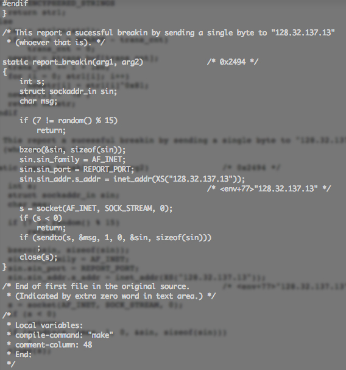

A 23‑year‑old Cornell graduate student named **Robert Tappan Morris** releases a self‑propagating program—the *first internet worm*—that exploits a bug in Unix’s sendmail program. Within hours it infects roughly 10 percent of all 60,000 hosts then on the internet.[^37]

Morris is convicted under the new **Computer Fraud and Abuse Act** and becomes the first person ever sentenced under it. The worm leads directly to the founding of **CERT**, the world’s first computer‑emergency response team. The military internet is no longer *safely military*; ordinary people now have to defend it.

---

## 1989.3.12 – Tim Berners‑Lee Proposes the World Wide Web

At **CERN**, the European particle‑physics laboratory in Geneva, British software engineer Tim Berners‑Lee submits a paper titled *Information Management: A Proposal* to his manager, Mike Sendall.[^38]

Sendall famously writes “**vague but exciting**” on the cover and approves the project. Berners‑Lee’s proposal combines hypertext—an idea going back to Vannevar Bush in 1945—with the existing TCP/IP internet to create a single global information system. Within two years he has built the world’s first web server, the world’s first web browser, and the world’s first website. Significantly, he releases all of it *into the public domain*, refusing to patent any part of it.

---

## 1989.11.9 – Fall of the Berlin Wall

Crowds tear down the **Berlin Wall**, ending 28 years of physical division between East and West Germany and signaling that the Cold War—the geopolitical justification for the entire ARPANET project—is collapsing.[^39]

Within two years the Soviet Union itself dissolves. The internet that the Pentagon built to survive a Soviet first strike has *outlived its enemy*. With the Cold War over, Congress immediately begins asking why the federal government is still running the network at all—a question that will produce, in 1995, the privatized commercial internet.

---

## 1990.2.28 – ARPANET Decommissioned

After twenty years and seven months of operation, the original **ARPANET**—the four‑node Pentagon experiment that began with the message “LO”—is officially shut down. Its remaining traffic is migrated to NSFNET.[^40]

There is no public ceremony. A handful of engineers gather at BBN to watch the last router power down. ARPANET ends not with a bang but with a sysadmin pulling a plug. The military‑academic phase of the internet is, formally, over.

---

## 1991.8.6 – First Public Webpage Goes Live

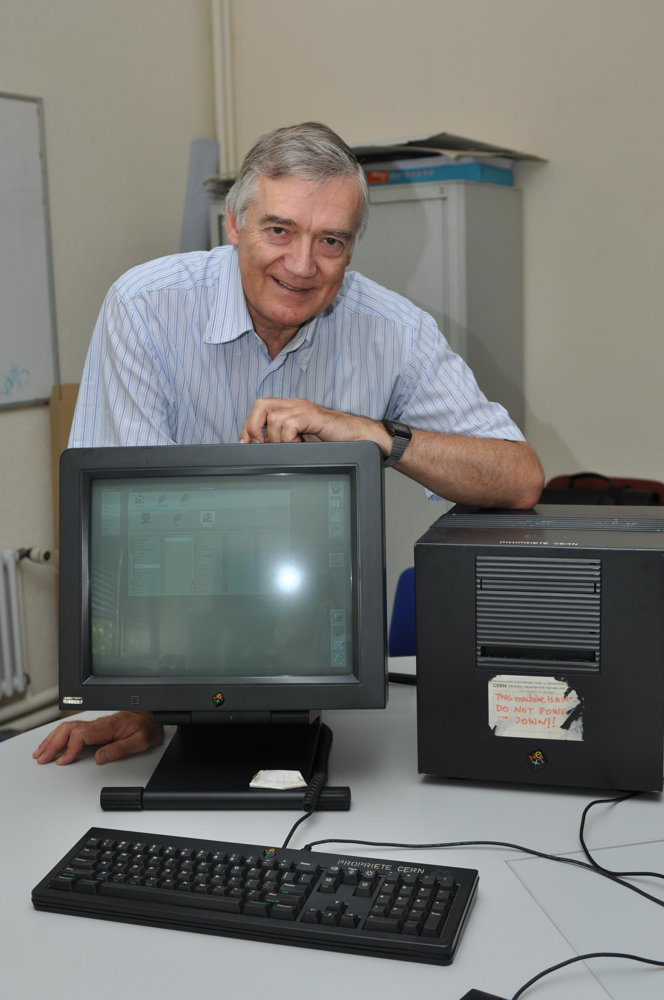

Berners‑Lee posts the first publicly available webpage at **info.cern.ch**, explaining what the World Wide Web is and how to make a webpage of one’s own.[^41]

For the first time, the *military internet* of ARPA and the *academic internet* of NSFNET have a friendly, hyperlinked face that any non‑engineer can read. From this single page, every webpage that has ever existed is descended.

---

## 1991.12.26 – Soviet Union Officially Dissolves

The Supreme Soviet ratifies the dissolution of the **Union of Soviet Socialist Republics**, ending the Cold War formally and leaving the United States as the world’s sole superpower.[^42]

The internet’s original threat model—surviving a Soviet nuclear strike—no longer exists. Within months Congress will pass the *Boucher amendment* allowing commercial traffic on NSFNET, and the privatization process that ends government ownership of the internet will begin.

---

## 1993.1.23 – Mosaic — The First Mass‑Market Web Browser

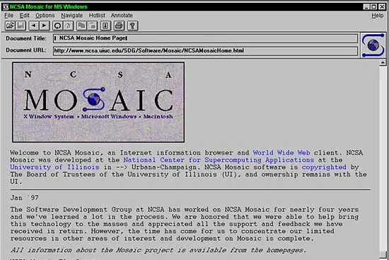

At the National Center for Supercomputing Applications in Illinois, undergraduate **Marc Andreessen** and his team release **Mosaic**, the first web browser that displays inline images and runs on Windows, Mac, and Unix.[^43]

Before Mosaic, the web has perhaps a few hundred sites; six months after Mosaic, it has tens of thousands. Andreessen drops out of school the next year to co‑found **Netscape**, beginning the dot‑com boom and effectively ending the academic phase of the World Wide Web.

---

## 1993.4.30 – CERN Releases the Web into the Public Domain

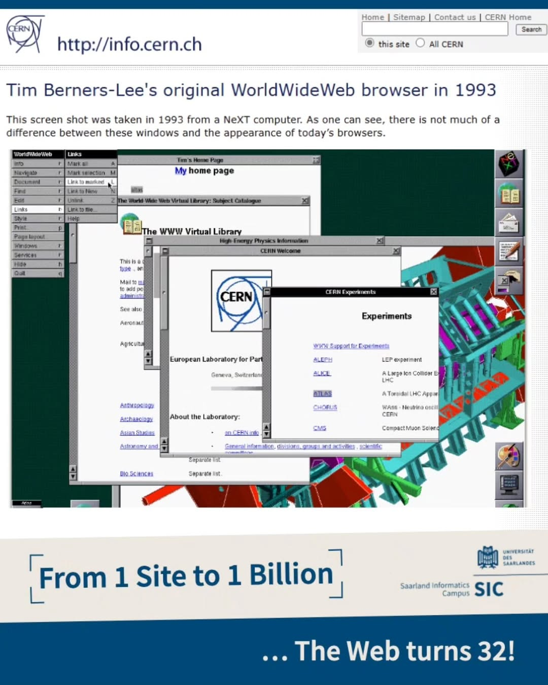

After two years of internal debate, **CERN** issues a single‑page document declaring that World Wide Web technology—Berners‑Lee’s HTTP protocol, HTML markup, and browser code—is now in the **public domain** and may be used by anyone, anywhere, royalty‑free.[^44]

This decision is, arguably, the single most consequential act of corporate generosity in the twentieth century. If CERN had patented the Web, today’s internet would look more like cable television—a small number of licensed channels rather than a billion personal homepages.

---

## 1994.4.4 – Netscape Communications Founded

Marc Andreessen and Silicon Valley veteran **Jim Clark** found Netscape Communications. Eighteen months later, the company will go public at $28 a share, close its first day at $58.25, and turn the 24‑year‑old Andreessen into the *first internet billionaire*.[^45]

The Netscape IPO is the official starting gun of the **dot‑com bubble**. Within five years, every American high‑school student will know what a “browser” is, and a network that was funded for thirty years by Pentagon and NSF appropriations will be worth more on the stock market than General Motors.

---

## 1995.4.30 – NSFNET Shuts Down — The Commercial Internet Begins

The **National Science Foundation Network**, the U.S. government’s main internet backbone since 1986, is officially decommissioned at midnight on April 30, 1995.[^46]

Its traffic is handed off to commercial carriers—MCI, Sprint, and a new company called UUNET. After thirty years of being **paid for by the Pentagon and the NSF**, the internet is now privately owned, privately operated, and open to commercial use. Amazon is founded the same year. eBay follows in September. Google arrives in 1998. The Cold War weapon has become a global marketplace.

---

## 1996.2.8 – Telecommunications Act and Section 230

President Clinton signs the **Telecommunications Act of 1996**, the first major overhaul of U.S. telecom law since 1934. Buried inside is **Section 230**, a 26‑word clause stating that interactive computer services are not legally liable for content posted by their users.[^47]

Section 230 is, arguably, the most important law in the history of the commercial internet. Without it, no platform—Google, YouTube, Facebook, Reddit, even high‑school discussion forums—could exist in their current form. Every American social‑media debate from 2016 onward is, at root, an argument about Section 230.

---

## 1998.9.4 – Google Inc. Founded

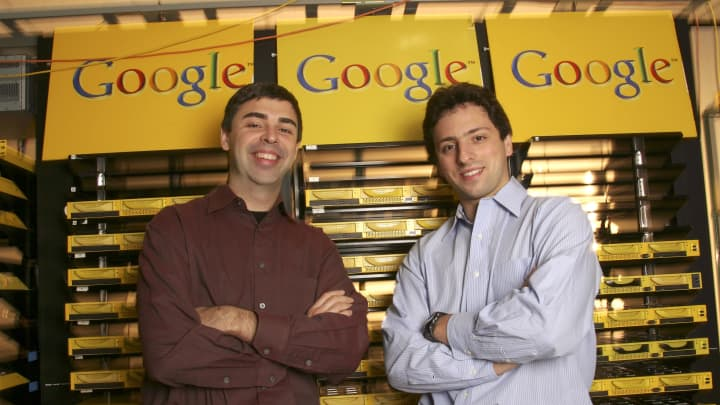

Stanford graduate students **Larry Page** and Sergey Brin incorporate **Google Inc.** in a Menlo Park garage, with a thesis‑project search algorithm called **PageRank**.[^48]

Within a decade, Google will be the most‑visited website on Earth and will reshape advertising, journalism, mapping, email, video, mobile phones, and artificial‑intelligence research. Page and Brin’s research is, like ARPANET before it, federally funded—by NSF Digital Library grants. *The internet’s commercial era begins, like its military era, with American taxpayer money.*

---

## 2001.9.11 – September 11 Attacks Transform the Internet

On the morning of September 11, 2001, al‑Qaeda hijackers crash two airliners into the World Trade Center and a third into the Pentagon. The internet—built by the Pentagon to survive a Soviet nuclear strike—becomes the crisis backbone as phone networks collapse: news sites distribute live updates, engineers swap router configurations in real time, and millions of ordinary Americans encounter the web as their primary emergency information source.[^49]

In the aftermath, Congress passes the USA PATRIOT Act (October 26), massively expanding the government’s surveillance powers over internet traffic. The internet is no longer a military‑academic experiment or a commercial bazaar; it is now, permanently, the central nervous system of the American security state. The same technology that once routed packets around bomb damage is asked to watch every packet for threat signals.

---

## 2007.6.29 – iPhone Launches — The Internet Moves into the Pocket

Apple releases the first iPhone, combining a phone, an iPod, and an internet communicator with a full web browser on a multi‑touch screen. Within a decade, over two billion people will carry a permanent internet connection in their pocket, transforming the network from a deskbound tool into an ambient, always‑on presence in daily life.[^50]

The internet’s center of gravity shifts from the browser‑based Web to mobile apps, location services, and social media feeds—and with it, the amount of personal data generated every second explodes. The digital traces left by billions of pocket devices become a new kind of intelligence asset, one that private companies and state actors alike learn to weaponize. Even the Pentagon’s original packet‑switching design never imagined a node that follows its user into a bedroom.

---

## 2010.6 – Stuxnet — The First Cyber Weapon Is Discovered

Security researchers discover Stuxnet, a highly sophisticated computer worm that has been quietly sabotaging uranium‑enrichment centrifuges at Iran’s Natanz facility by causing them to spin destructively while reporting normal conditions to the control room.[^51]

Stuxnet is the first confirmed instance of a digital weapon causing physical destruction across an air‑gapped network. It marks the moment the internet’s military origins complete a dark circle: the network built to survive nuclear war has itself become a delivery system for precision strikes that can cripple a nation’s infrastructure without a single bomb being dropped. The United States and Israel are widely understood to have developed the worm jointly, though neither government acknowledges it publicly.

---

## 2013.6.5 – Edward Snowden Reveals Mass Internet Surveillance

Former NSA contractor Edward Snowden meets journalists in a Hong Kong hotel room and hands over thousands of classified documents detailing PRISM, XKeyscore, and other signals‑intelligence programs that vacuum up internet traffic from phone calls, email, social media, and search histories of millions of people worldwide—including American citizens.[^52]

The disclosures reveal that the internet, originally designed as a decentralized survival network, has been turned into a centralized surveillance grid by the very government that funded it. The institutional fight over encryption, data privacy, and the balance between security and civil liberties that follows defines the next decade of internet policy. Snowden becomes a permanent exile in Russia; the debate he ignited never ends.

---

## 2022.2.26 – Starlink Keeps Ukraine Online Under Invasion

Two days after Russia’s full‑scale invasion of Ukraine, Ukrainian Vice Prime Minister Mykhailo Fedorov tweets at Elon Musk asking for Starlink terminals; within hours the first dishes arrive, and within weeks thousands of low‑Earth‑orbit satellite receivers are keeping government offices, hospitals, and front‑line units connected as terrestrial networks are bombed out.[^53]

The internet’s original Cold War purpose—to maintain connectivity after a nuclear strike—is realized not by a Pentagon bunker network but by a private company’s constellation of cheap satellites, controlled by a single billionaire who can, as the war drags on, unilaterally decide where the network does and does not work. The episode rewrites the rulebook on who governs the global internet in a conflict, handing state‑level power over connectivity to a corporation.

---

## 2022.11.30 – ChatGPT Sends the Internet Into the AI Age

OpenAI releases ChatGPT, a conversational large language model, to the public. It reaches one million users in five days and 100 million in two months—the fastest consumer technology adoption in history—and within a year generative AI tools are transforming how the internet produces text, images, code, and video.[^54]

The scale and speed of AI’s arrival reframes the internet yet again: a network built to share military research papers becomes a medium that can autonomously generate misinformation, propaganda, and synthetic media indistinguishable from human output. The 2025 AI chip export controls and the Anthropic Claude misuse report are direct responses to the revolution that ChatGPT begins, returning internet policy debates to the same Cold War logic that birthed ARPANET—a race to control the next strategic technology before an adversary does.

---

## 2025.1.13 – Biden Tightens AI Chip Export Controls

In its final week, the Biden administration issues the **“AI Diffusion” Interim Final Rule**, dividing every country in the world into three tiers and sharply restricting which nations can buy advanced Nvidia chips and have them shipped from American soil.[^55]

The Trump administration, taking office days later, keeps most of the framework in place. The result is the most aggressive U.S. attempt since the 1950s to **deny adversaries access to a strategic technology**—and an explicit echo of Cold War‑era CoCom export controls on Soviet computing. The internet’s underlying hardware is once again a contested frontier.

---

## 2025.5.13 – Trump Rescinds Biden’s AI Diffusion Rule

Four months after taking office, the Trump administration’s Department of Commerce announces it will **rescind** the AI Diffusion Interim Final Rule that the Biden administration had issued in January, replacing it with a forthcoming framework that drops the three‑tier country system but keeps tight restrictions on advanced‑chip exports to China and other adversary states.[^56]

The reversal is a rare case in which the *direction* of U.S. tech policy changes administration to administration but the *underlying logic*—deny adversaries access to advanced computing—does not. Eighty years after Hiroshima, the internet’s silicon supply chain is once again the most contested strategic frontier in U.S. national‑security policy.

---

## 2025.11.13 – Anthropic Reports Claude Used for State‑Linked Hacking

In a public **threat report**, AI lab Anthropic discloses that its Claude models have been misused by what it describes as *China‑based threat actors* to conduct cyber‑espionage against U.S. tech, finance, and government targets.[^57]

For the first time, an AI company is publicly framing its own product the way the Pentagon once framed ARPANET—a **dual‑use technology** that has to be defended against the very adversaries it can be used against. The internet, eighty years after Hiroshima, is once again a Cold War battlefield. Just with new combatants and a new generation of weapons.

---

## Footnotes

[^1]: Ceruzzi, Paul E. *A History of Modern Computing*, 2nd ed. MIT Press, 2003.

[^2]: Copeland, B. Jack. *Colossus: The Secrets of Bletchley Park’s Codebreaking Computers*. Oxford University Press, 2006.

[^3]: von Neumann, John. *First Draft of a Report on the EDVAC*. Moore School of Electrical Engineering, University of Pennsylvania, June 30, 1945.

[^4]: Bush, Vannevar. “As We May Think.” The Atlantic Monthly, July 1945, 101–108.

[^5]: Hersey, John. “Hiroshima.” The New Yorker, August 31, 1946. The bomb’s psychological legacy directly motivated the survivable‑network research that would produce ARPANET.

[^6]: Goldstine, Herman H. *The Computer from Pascal to von Neumann*. Princeton University Press, 1972.

[^7]: Riordan, Michael, and Lillian Hoddeson. *Crystal Fire: The Birth of the Information Age*. New York: W. W. Norton, 1997.

[^8]: Shannon, Claude E. “A Mathematical Theory of Communication.” *Bell System Technical Journal* 27 (July 1948): 379–423.

[^9]: Holloway, David. *Stalin and the Bomb: The Soviet Union and Atomic Energy, 1939–1956*. Yale University Press, 1994.

[^10]: Stern, Nancy. *From ENIAC to UNIVAC: An Appraisal of the Eckert‑Mauchly Computers*. Digital Press, 1981.

[^11]: Rhodes, Richard. *Dark Sun: The Making of the Hydrogen Bomb*. Simon & Schuster, 1995.

[^12]: Edwards, Paul N. *The Closed World: Computers and the Politics of Discourse in Cold War America*. MIT Press, 1996.

[^13]: Headrick, Daniel R. *The Invisible Weapon: Telecommunications and International Politics*. Oxford University Press, 1991.

[^14]: McDougall, Walter A. *The Heavens and the Earth: A Political History of the Space Age*. New York: Basic Books, 1985.

[^15]: Hafner, Katie, and Matthew Lyon. *Where Wizards Stay Up Late: The Origins of the Internet*. New York: Simon & Schuster, 1996.

[^16]: Reid, T. R. *The Chip: How Two Americans Invented the Microchip and Launched a Revolution*. Random House, 2001.

[^17]: Corbató, F. J., et al. “An Experimental Time‑Sharing System.” *Proceedings of the AFIPS Spring Joint Computer Conference*, May 1962.

[^18]: Licklider, J. C. R. “Memorandum For Members and Affiliates of the Intergalactic Computer Network.” ARPA Internal Memorandum, April 23, 1963.

[^19]: May, Ernest R., and Philip D. Zelikow, eds. *The Kennedy Tapes: Inside the White House During the Cuban Missile Crisis*. Harvard University Press, 1997.

[^20]: Baran, Paul. *On Distributed Communications: I. Introduction to Distributed Communications Networks*. Santa Monica: RAND Corporation, August 1964.

[^21]: Marill, T., and L. G. Roberts. “Toward a Cooperative Network of Time‑Shared Computers.” *AFIPS Conference Proceedings*, October 1966.

[^22]: Davies, Donald W. “Proposal for a Digital Communication Network.” NPL Report, June 1966.

[^23]: Engelbart, Douglas C., and W. K. English. “A Research Center for Augmenting Human Intellect.” *AFIPS Conference Proceedings*, December 9, 1968.

[^24]: Mindell, David A. *Digital Apollo: Human and Machine in Spaceflight*. MIT Press, 2008.

[^25]: Kleinrock, Leonard. “An Early History of the Internet.” IEEE Communications Magazine 48, no. 8 (August 2010): 26–36.

[^26]: Tomlinson, Raymond. “The First Network Email.” BBN Technologies Internal Note, 1971.

[^27]: Hafner, Katie, and Matthew Lyon. *Where Wizards Stay Up Late: The Origins of the Internet*. Simon & Schuster, 1996.

[^28]: Metcalfe, Robert M., and David R. Boggs. “Ethernet: Distributed Packet Switching for Local Computer Networks.” *Communications of the ACM* 19, no. 7 (July 1976): 395–404.

[^29]: Cerf, Vinton G., and Robert E. Kahn. “A Protocol for Packet Network Intercommunication.” *IEEE Transactions on Communications* 22, no. 5 (May 1974): 637–648.

[^30]: Cerf, Vinton G. “How the Internet Came to Be.” In *The Online User’s Encyclopedia*, edited by Bernard Aboba. Addison‑Wesley, 1993.

[^31]: Hauben, Michael, and Ronda Hauben. *Netizens: On the History and Impact of Usenet and the Internet*. IEEE Computer Society Press, 1997.

[^32]: Cringely, Robert X. *Accidental Empires*. Addison‑Wesley, 1992.

[^33]: Leiner, Barry M., et al. “Brief History of the Internet.” Internet Society, 1997 (revised 2017).

[^34]: Mockapetris, Paul V. “Domain Names: Concepts and Facilities.” RFC 882, IETF, November 1983.

[^35]: FitzGerald, Frances. *Way Out There in the Blue: Reagan, Star Wars, and the End of the Cold War*. Simon & Schuster, 2000.

[^36]: Abbate, Janet. *Inventing the Internet*. MIT Press, 1999.

[^37]: United States v. Morris, 928 F.2d 504 (2d Cir. 1991).

[^38]: Berners‑Lee, Tim. “Information Management: A Proposal.” CERN Internal Document, March 1989.

[^39]: Sebestyen, Victor. *Revolution 1989: The Fall of the Soviet Empire*. Pantheon Books, 2009.

[^40]: Salus, Peter H. *Casting the Net: From ARPANET to Internet and Beyond*. Addison‑Wesley, 1995.

[^41]: Berners‑Lee, Tim. “World Wide Web Project.” info.cern.ch, August 6, 1991.

[^42]: Service, Robert. *The End of the Cold War: 1985–1991*. Public Affairs, 2015.

[^43]: Reid, Robert H. *Architects of the Web: 1,000 Days that Built the Future of Business*. John Wiley & Sons, 1997.

[^44]: CERN. “Statement Concerning CERN W3 Software Release into Public Domain.” CERN Document, April 30, 1993.

[^45]: Lewis, Michael. *The New New Thing: A Silicon Valley Story*. W. W. Norton, 2000.

[^46]: National Science Foundation. “NSFNET—The Partnership That Changed the World.” NSF Historical Record, 2007.

[^47]: Kosseff, Jeff. *The Twenty‑Six Words That Created the Internet*. Cornell University Press, 2019.

[^48]: Levy, Steven. *In the Plex: How Google Thinks, Works, and Shapes Our Lives*. Simon & Schuster, 2011.

[^49]: National Commission on Terrorist Attacks Upon the United States. *The 9/11 Commission Report*. W. W. Norton, 2004. See also Hafner and Lyon, *Where Wizards Stay Up Late*, for the irony of ARPANET’s survivability becoming a civil requirement.

[^50]: Isaacson, Walter. *Steve Jobs*. Simon & Schuster, 2011; also Apple Inc. Press Release, “Apple Reinvents the Phone with iPhone,” January 9, 2007.

[^51]: Zetter, Kim. *Countdown to Zero Day: Stuxnet and the Launch of the World’s First Digital Weapon*. Crown, 2014.

[^52]: Greenwald, Glenn. *No Place to Hide: Edward Snowden, the NSA, and the U.S. Surveillance State*. Metropolitan Books, 2014. NSA programs were confirmed in declassified FISC opinions.

[^53]: Musk, Elon, via Twitter, 26 Feb 2022, confirming the shipment; see also “How Elon Musk’s Starlink Became Invaluable to Ukraine’s War Effort,” *The Washington Post*, 19 March 2022.

[^54]: OpenAI. “Introducing ChatGPT,” 30 November 2022; Reuters, “ChatGPT sets record for fastest‑growing user base,” 2 February 2023.

[^55]: U.S. Department of Commerce, Bureau of Industry and Security. “Framework for Artificial Intelligence Diffusion.” *Federal Register*, January 15, 2025.

[^56]: Bischoff, Paul. “Trump Administration Officially Rescinds Biden’s AI Diffusion Rules.” *TechCrunch*, May 13, 2025.

[^57]: Fried, Ina. “Chinese Hackers Used Anthropic’s Claude AI Agent to Automate Spying.” *Axios*, November 13, 2025.
